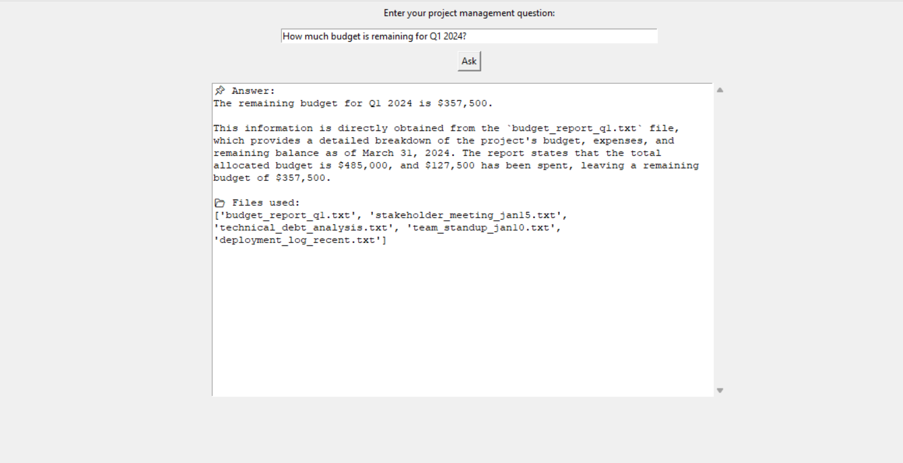

# Project Management Assistant

An **interactive Python assistant** that answers project management questions by analyzing TXT project files using an LLM (Groq/Ollama) and semantic embeddings.

---

## **Features**

- Ask project management questions via a **simple GUI**.
- Automatically selects the **most relevant TXT files** using embeddings.
- Generates **reasoning-based answers** using a large language model.
- Supports **multiple questions** without restarting.
- **Safe API key handling** using `.env` files.

---

## **How It Works**

1. **User Input:** You type a project-related question in the GUI.  
2. **File Selection:** Computes embeddings of all TXT files and selects the top relevant files.  
3. **Analysis:** The selected files’ content is sent to the LLM to generate a clear, concise answer.  
4. **Response:** Displays the answer along with the list of files used.

**Workflow Diagram:**

## Screenshot

Here is how the GUI looks when asking a question:

